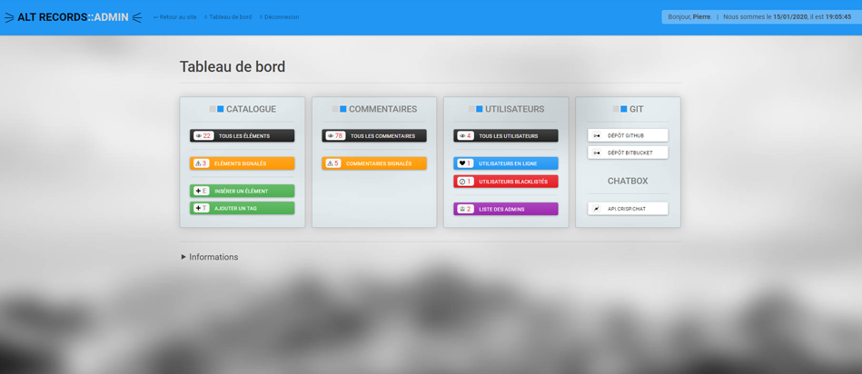

#
# ALT-Records

Music catalog with admin dashboard, made with Symfony 4



## Getting Started

These instructions will get you a copy of the project up and running on your local machine for development and testing purposes. See deployment for notes on how to deploy the project on a live system.

### Prerequisites

In order to use Symfony 4, make sure you have PHP version 7.1.3 or higher on your system. See [official site](https://www.php.net/) for details.

### Installing

Update composer with this command

```
composer update
```

Then run your localhost server (make sure to enable WAMP (or XAMP))

```
php bin/console server:run
```

## Deployment

Update your DB informations and paths in the *.env* file.

## Built With

* [Symfony 4](https://symfony.com/) - The web framework used
* [Visual Studio Code](https://code.visualstudio.com/) - The IDE used

## Bundles used

* [Faker](https://github.com/fzaninotto/Faker) - Fixtures
* [Swift Mailer](https://swiftmailer.symfony.com/docs/introduction.html) - Mailing Management
* [Gedmo/Stof](https://www.davidlangin.fr/articles/symfony-4-sluggable) - Slug
* [Knp Paginator](https://github.com/KnpLabs/KnpPaginatorBundle) - Pagination
* [Crisp](https://crisp.chat/fr/) - Chatbox system

## Authors

* **Pierre Arthur Lejeune** - *Initial work* - [ALT Records](https://github.com/plejeune/alt-records)

## License

This project is licensed under the MIT License - see [this](https://fr.wikipedia.org/wiki/Licence_MIT) for details


